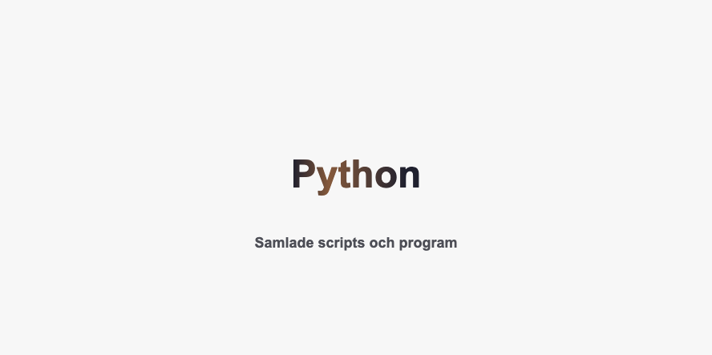

# Välkommen till mitt Python Script Repo

Det här är mitt personliga GitHub-repo där jag samlar och delar Python-script som jag har utvecklat under min pågående utbildning och på min fritid. I den här översikten finner du några av de projekt och script jag har inkluderat.

## Översikt över Script

### Script 1: [Glosövning](länk till script 1)
Öva på gloser direkt från din terminal.

### Script 2: [Namn på Script 2](länk till script 2)
Kort beskrivning av vad scriptet gör och dess syfte.

### Script 3: [Namn på Script 3](länk till script 3)
Kort beskrivning av vad scriptet gör och dess syfte.

## Kom igång

För att använda eller testa något av scripten, följ dessa enkla steg:

1. Klona detta repo till din lokala maskin: `git clone länk-till-ditt-repo.git`
2. Navigera till den specifika mappen för det script du är intresserad av.
3. Följ anvisningarna i README-filen i den mappen för att köra scriptet.

## Bidra

Om du är intresserad av att bidra eller förbättra något av scripten, välkomnar jag ditt engagemang. Du kan kontakta mig eller skapa en "pull request" för eventuella ändringar, buggfixar eller nya idéer.

